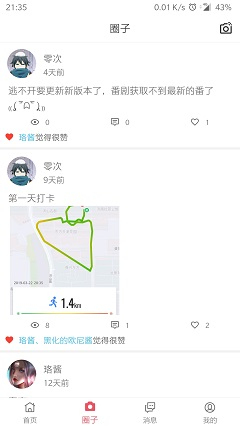
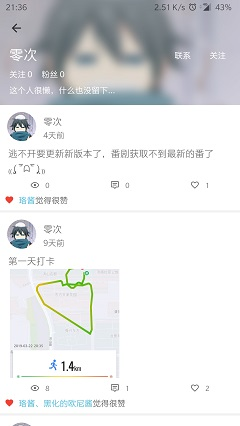

## 关于灵悉  

个人兴趣项目，此代码为app端代码  
当前版本包含一图一言，用户注册登录，修改头像，写给未来，动态发布，评论回复，查看我的回复、与我相关等  
项目一直在无规律更新，坚持全凭兴趣，服务端查看[灵悉-server](https://github.com/happycao/lingxi-server)  
网络为OkHttp，只做了简单的get及post请求封装，如有更多需求请选择更好的轮子  
Glide版本4.1.1，与之对应PhotoPicker版本0.9.12、glide-transformations版本3.0.1  
调试请使用alpha版本，local版本为本人本地使用，online版本为发布打包版本  
体验请直接点击下载打包版本[点击下载测试版](http://42.192.229.55/download/lingxi-test.apk)
如果不是用于测试，欢迎来正式版一起玩耍[点击下载正式版](http://42.192.229.55/download/lingxi.apk)

**[2021/05/30]**  
1、采用viewmodel剥离网络请求，轻量化Activity/Fragment  

**[2021/05/09]**  
1、此版本升级不可逆，建议悉知所有变更项，如果只是服务不可以，可升级到2021/03/15版本  
2、废弃ButterKnife，采用viewBinding，因此涉及代码较多，升级不可逆  
3、升级Gradle版本到6.6.1，升级gradle build tools到4.0.1，以支持viewBinding  
4、将PhotoPicker只作为本地模块依赖，解决远程包无法下载，同时依赖androidx的包  
5、升级recyclerview版本到1.2.0，获得ConcatAdapter的支持  
6、再次建议测试使用`alpha`版本打包  

**[2021/03/15]**  
1、迁移服务器，旧版本将无法使用，请尽快升级  
2、发布动态时支持查询添加话题和@人  

**[19/10/18]**  
1、移除历史提交，移除了exoPlayer，仅保留灵悉本体功能  
2、迁移至androidx，minSdkVersion变更为21  
3、首页一图一言支持两个图源，可在设置变更为图鉴源  
4、全局白色主题  
5、~~写给未来app内暂时无法查看~~，20/05/17获得支持  

### 灵悉相关  

- 生无彩凤双飞翼，心有灵犀一点通  
- 依托于社交群组，好友向社交圈，供用户吐槽交流  
- [x] 用户注册登陆  
- [x] 首页一图一言  
- [x] 动态发布点赞评论  
- [x] 写给未来的信  
- [x] 分享链接到灵悉  
- [x] app更新跳转浏览器下载更新  
- [x] Toast彩蛋  
- [ ] 个人信息修改  
- [x] 动态发布支持话题  
- [x] 动态支持@用户  
- [ ] 支持用户动态删除  
- [ ] 支持话题分组  
  
### 截图展示  

## 反馈与建议
- QQ：986417980  
- 交流群：387355490  
  

欢迎star，感谢阅读这份文档。  